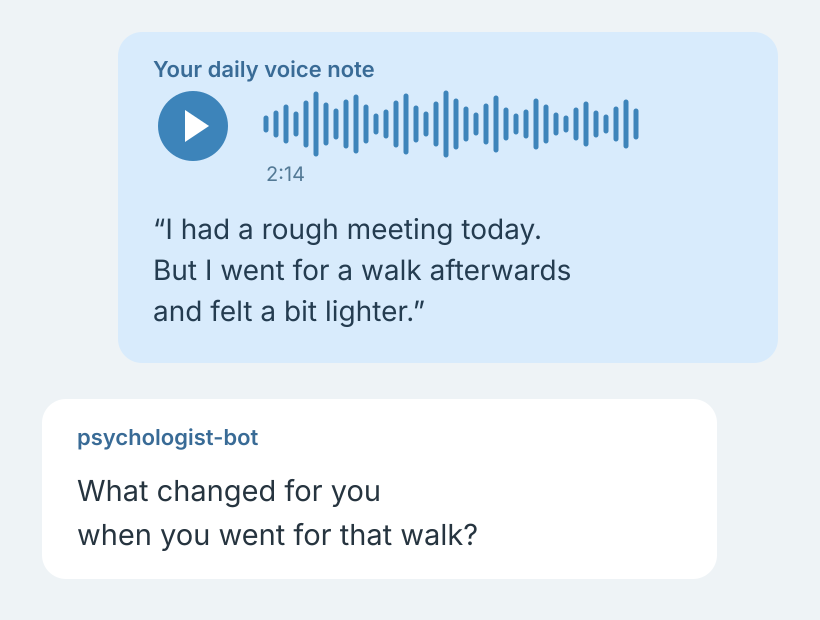
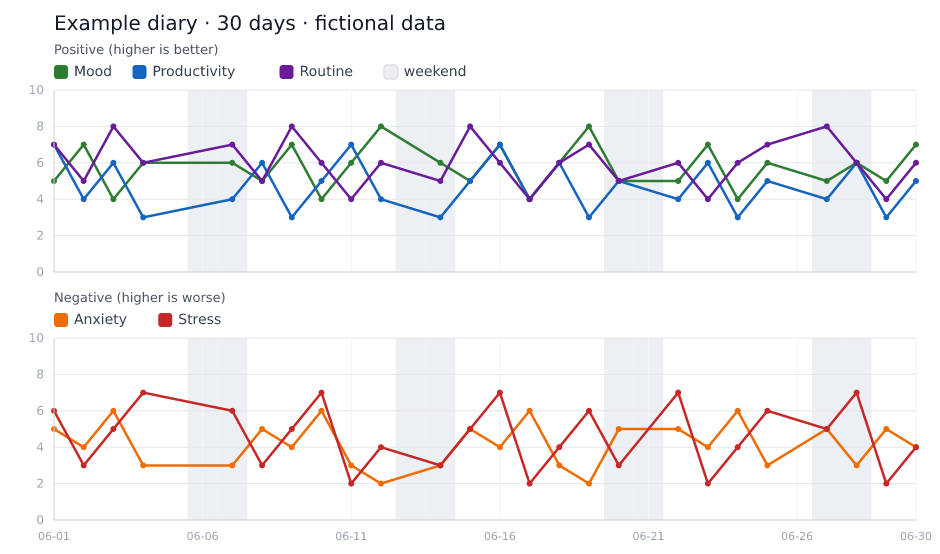

# Psychologist Bot

A voice diary in Telegram: tell it how your day went, out loud. The bot turns the recording into a diary entry and helps you reflect using cognitive behavioral therapy (CBT). It remembers earlier entries, so you can continue a conversation over time. Weekly and monthly letters let you look back with context and charts.



*Example conversation with fictional dialogue.*

## Start with a voice note

At the end of the day, open your private Telegram channel and record whatever is on your mind. Speak as you would in a voice message to a friend; the bot handles the transcription. You can also write a text entry. It responds using cognitive behavioral therapy techniques: examining the evidence for a thought, identifying distortions, and finding a more precise way to express it. When an entry contains a harsh verdict about yourself, it can offer a short replacement sentence to say aloud.

Reply under the entry to continue. The thread retains the conversation, and you can ask for an audio reply. Later entries draw on summaries of the previous ten days and longer-term memory. With embeddings enabled, the bot retrieves related older episodes; it also tracks recurring themes across recent weeks.

## Looking back

The weekly letter uses dated examples and your own words to revisit what you did, connect events across days, and return to what remains unresolved. It can include support you received from other people. A monthly letter looks across a longer period. Both include the same 30-day metrics chart.



*Rendered by the bot’s own chart code using fictional data. Missing days have no markers.*

Metrics come from diary entries on a 0–10 scale. Mood, productivity and routine share one panel; anxiety and stress appear below it. `/weekly` and `/monthly` also generate letters on demand.

## Your diary, your boundaries

Use `/veto` to save topics or phrasing that the weekly and monthly letters should avoid. You can inspect or regenerate memory, export entries as CSV, and see transcription and model costs. The bot supports Russian and English. An evening reminder skips days with an entry after the configured evening boundary.

This is a self-hosted reflection tool. Diary data is stored in SQLite; transcription and model requests go to the providers you configure.

## Channel Commands

Type these in the **channel** (not the discussion group):

| Command | What it does |
|---------|-------------|
| `/weekly` | Generate weekly report (Monday → today) |
| `/monthly` | Generate monthly report (1st → today) |
| `/veto` | List standing "never raise this again" instructions |
| `/veto <text>` | Add one; `/veto -3` removes it by number |
| `/export` | Download all entries as CSV |
| `/memory` | Show long-term memory |
| `/recentmemory` | Show short-term daily memory |
| `/generatememory` | Regenerate long-term memory |
| `/generaterecentmemory` | Regenerate short-term memory for the last 10 days |

## Setup

```bash
# 1. Clone and install
git clone https://github.com/Evgeny-/psychologist-bot.git
cd psychologist-bot
npm install

# 2. Configure
cp .env.example .env
# Edit .env with your API keys and Telegram IDs

# 3. Run
npm run dev    # development (auto-reload)
npm run build  # compile
npm start      # production
```

You'll need:
- A Telegram bot ([@BotFather](https://t.me/BotFather))
- A private Telegram channel with a linked discussion group
- Bot added as admin to both
- API keys for at least one LLM (Anthropic or OpenAI) and one ASR (ElevenLabs or OpenAI)

## Configuration

All settings via environment variables — see [.env.example](.env.example).

Key ones:
- `LLM_PROVIDER` — `claude` or `openai`
- `ASR_PROVIDER` — `elevenlabs` or `openai`
- `TTS_PROVIDER` — `elevenlabs` or `openai`
- `COMPARE_MODE=true` — run all LLM providers in parallel
- `BOT_LANGUAGE` — `ru` or `en`. Covers both halves: every system prompt has a Russian and an English variant, and all bot-facing text (headings, report titles, reminders) comes from `src/i18n/`. Adding a user-facing string means adding it to `ru.ts`, `en.ts` and the `Strings` interface — never inline it in a service.
- `BOT_USER_NAME` — optional first name, used only to address you in the say-this-out-loud line. Left unset, it falls back to plain second person
- `BOT_TIMEZONE` — for correct date calculations (e.g. `Europe/Amsterdam`)

Scheduled jobs use `BOT_TIMEZONE`: the 20:30 reminder, the 23:55 memory consolidation, the weekly letter on Monday at 10:00 and the monthly one on the 1st at 10:00.

`EVENING_FROM_HOUR` in `src/config.ts` is the hour from which an entry counts as summing the day up. Two things read it and must not drift apart: the 20:30 reminder skips days that already have an entry from that hour on, and the daily prompt refuses to infer metrics from a word description written earlier — mornings describe a day not yet lived.

Runtime logs are written both to stdout/journald and to `logs/app.log` in logfmt-style single-line entries, so stage timings can be grepped without digging through raw stack traces.

For voice replies:
- Set `ELEVENLABS_TTS_VOICE_ID` if you want ElevenLabs TTS as the primary voice provider
- Or rely on OpenAI TTS fallback with `OPENAI_TTS_MODEL` and `OPENAI_TTS_VOICE`

## Tech Stack

TypeScript, Node.js (ESM), [grammy](https://grammy.dev/), SQLite (better-sqlite3), node-cron, ElevenLabs Scribe v2, Claude Sonnet 4.6, OpenAI GPT-5.4 mini

## License

MIT
